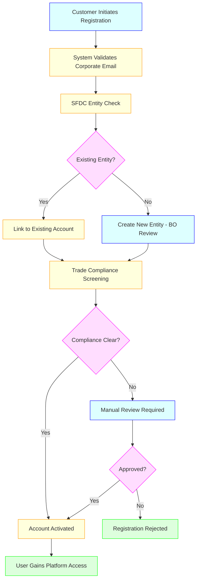
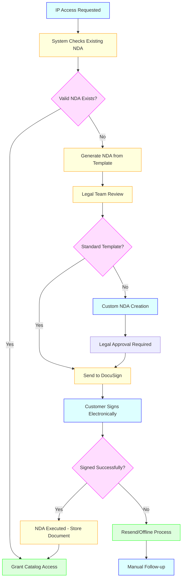
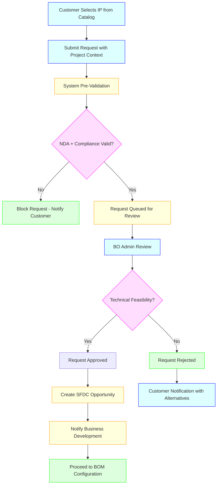
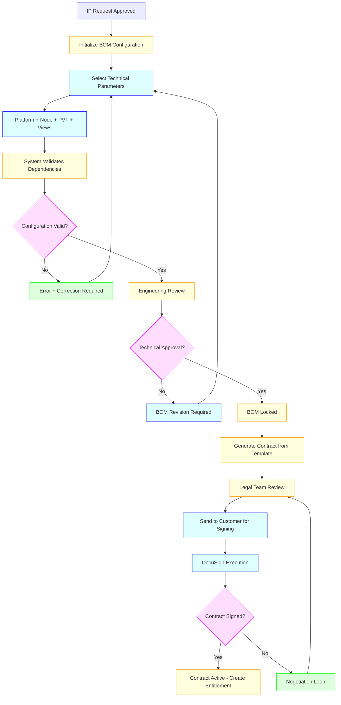
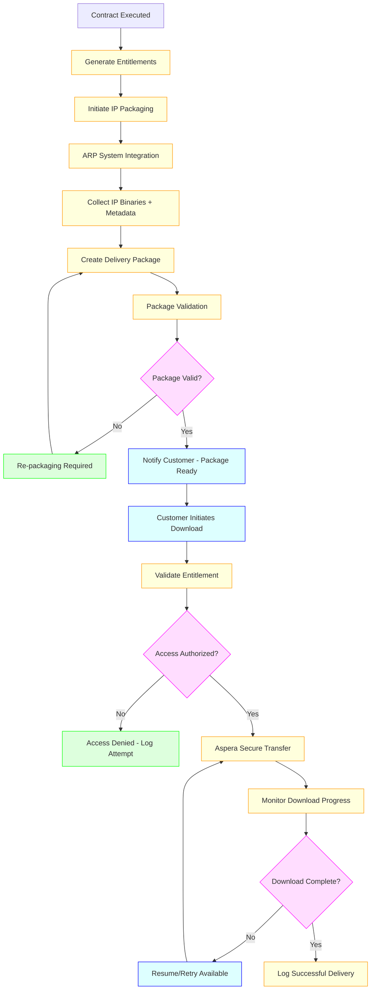

# Business & Functional Requirements
## Advanced Delivery Platform (ADP)

**Version:** 1.0  
**Date:** March 24, 2026  
**Document Owner:** Product Management  

---

## 1. Purpose

This document defines the detailed business and functional requirements for the Advanced Delivery Platform (ADP), a centralized enterprise system that manages the complete lifecycle of semiconductor IP delivery from customer onboarding through secure download.

## 2. Scope

### In-Scope:
- Customer onboarding and access management
- NDA lifecycle management and execution
- IP catalog creation, maintenance, and browsing
- IP request processing and approval workflows
- BOM (Bill of Materials) configuration and validation
- Contract generation, negotiation, and execution
- Entitlement processing and access control
- IP packaging and secure delivery
- Integration with Salesforce, DocuSign, ARP, and Aspera
- Compliance and export control validation
- Audit trails and reporting

### Out-of-Scope:
- IP development and creation tools
- Financial invoicing and payment processing
- Customer support ticketing systems
- Advanced analytics dashboards (Phase 2)
- Mobile applications (Phase 2)
- ERP integrations beyond Salesforce

## 3. Stakeholders

### Primary:
- **Customers:** External users requesting and accessing IP
- **Business Operations Team:** Process management and workflow oversight
- **Product Management:** Platform capability definition and roadmap

### Secondary:
- **Legal Team:** Contract and NDA review and approval
- **Trade Compliance:** Export control and regulatory validation
- **Engineering Teams:** Technical validation and IP packaging
- **Business Development:** Opportunity management and deal negotiation
- **System Administrators:** Platform configuration and maintenance

## 4. Key Use Cases

### Use Case UC-001: Customer Onboarding
**Description:** External user registers and gains platform access  
**Actors:** Customer, BO Admin, Trade Compliance, System  
**Preconditions:** User has corporate email and company information  

**Main Flow:**


**Alternate Flows:**
- Compliance flag triggers manual review process
- SFDC sync failure requires manual account creation
- Duplicate detection with different company naming variations

### Use Case UC-002: NDA Management
**Description:** Customer executes NDA before accessing confidential IP  
**Actors:** Customer, Legal Team, System  
**Preconditions:** Customer account is active and validated  

**Main Flow:**


**Alternate Flows:**
- Customer requests custom NDA terms requiring legal negotiation
- NDA expires during active engagement requiring renewal
- Offline signature process for customers unable to use DocuSign

### Use Case UC-003: IP Request and Approval
**Description:** Customer submits formal request for specific IP assets  
**Actors:** Customer, BO Admin, Business Development, System  
**Preconditions:** Valid NDA, compliance clearance, catalog access  

**Main Flow:**


**Alternate Flows:**
- Multiple IPs requested in single request requiring batch processing
- Off-platform requests initiated by sales team requiring manual entry
- Engineering risk assessment required for complex configurations

### Use Case UC-004: BOM Configuration and Contract Execution
**Description:** Define technical configuration and execute licensing contract  
**Actors:** Customer, BO Admin, Legal Team, Business Development  
**Preconditions:** Approved IP request, active SFDC opportunity  

**Main Flow:**


**Alternate Flows:**
- BOM changes after approval requiring version control
- Contract amendments during negotiation requiring legal re-review
- Multi-party signing for complex enterprise agreements

### Use Case UC-005: IP Delivery and Download
**Description:** Package and deliver IP assets securely to entitled customers  
**Actors:** Customer, Release Engineer, System  
**Preconditions:** Active contract, valid entitlements, signed NDA  

**Main Flow:**


**Alternate Flows:**
- Partial downloads for subset of IP views
- Re-download requests within entitlement period
- Access revocation due to contract expiry or compliance issues

## 5. Functional Requirements

### Customer Management (FR-001 to FR-010)

1. **FR-001:** System shall provide self-service customer registration with corporate email validation
2. **FR-002:** System shall integrate with enterprise SSO and enforce multi-factor authentication
3. **FR-003:** System shall validate customer entities against Salesforce CRM
4. **FR-004:** System shall perform automated trade compliance screening before account activation
5. **FR-005:** System shall support role-based access control for customer users
6. **FR-006:** System shall maintain complete audit trail of customer activities
7. **FR-007:** System shall support account suspension and deactivation workflows
8. **FR-008:** System shall detect and prevent duplicate registrations
9. **FR-009:** System shall validate corporate domains and prevent personal email registration
10. **FR-010:** System shall support customer profile management and updates

### NDA Management (FR-011 to FR-020)

11. **FR-011:** System shall validate existing NDA status before granting catalog access
12. **FR-012:** System shall generate NDAs from approved legal templates
13. **FR-013:** System shall integrate with DocuSign for electronic signature workflows
14. **FR-014:** System shall support custom NDA creation and legal review processes
15. **FR-015:** System shall track NDA expiry dates and trigger renewal notifications
16. **FR-016:** System shall maintain version control for NDA amendments
17. **FR-017:** System shall support offline signature processes with document upload
18. **FR-018:** System shall store executed NDAs with secure access controls
19. **FR-019:** System shall prevent IP access for customers with expired or missing NDAs
20. **FR-020:** System shall provide NDA status reporting and compliance dashboards

### Catalog Management (FR-021 to FR-035)

21. **FR-021:** System shall support hierarchical IP catalog organization (Foundry → Node → Platform → Architecture → SKU)
22. **FR-022:** System shall enable bulk catalog upload with validation rules
23. **FR-023:** System shall maintain IP catalog versioning without overwrite capability
24. **FR-024:** System shall track all catalog changes with complete audit trails
25. **FR-025:** System shall support visibility control (Standard vs. Custom IP)
26. **FR-026:** System shall provide catalog promotion workflows (Custom → Standard)
27. **FR-027:** System shall enable advanced search and filtering capabilities
28. **FR-028:** System shall support IP comparison functionality
29. **FR-029:** System shall provide shortlisting and bookmarking features
30. **FR-030:** System shall display technical specifications and metadata
31. **FR-031:** System shall validate IP dependencies and compatibility
32. **FR-032:** System shall support catalog access control based on NDA status
33. **FR-033:** System shall enable catalog browsing with performance optimization
34. **FR-034:** System shall track catalog usage analytics and user behavior
35. **FR-035:** System shall support search result ranking and relevance scoring

### IP Request Processing (FR-036 to FR-050)

36. **FR-036:** System shall capture structured IP requests with project context
37. **FR-037:** System shall validate NDA and compliance status before request submission
38. **FR-038:** System shall support multi-IP selection in single requests
39. **FR-039:** System shall provide request approval workflows with BO admin review
40. **FR-040:** System shall automatically create Salesforce opportunities upon request approval
41. **FR-041:** System shall support off-platform request integration and synchronization
42. **FR-042:** System shall track request status and provide customer notifications
43. **FR-043:** System shall enable request modification and resubmission workflows
44. **FR-044:** System shall support batch request processing capabilities
45. **FR-045:** System shall validate technical feasibility before approval
46. **FR-046:** System shall maintain request history and audit trails
47. **FR-047:** System shall support request rejection with alternative recommendations
48. **FR-048:** System shall enable escalation workflows for complex requests
49. **FR-049:** System shall integrate with engineering systems for risk assessment
50. **FR-050:** System shall provide request analytics and conversion tracking

### BOM Configuration (FR-051 to FR-065)

51. **FR-051:** System shall enable technical parameter selection (Platform, Node, PVT, Views)
52. **FR-052:** System shall validate BOM configuration against available IP variants
53. **FR-053:** System shall automatically detect and resolve IP dependencies
54. **FR-054:** System shall support BOM version control and change tracking
55. **FR-055:** System shall provide engineering review workflows for BOM approval
56. **FR-056:** System shall validate technical compatibility between selected components
57. **FR-057:** System shall support custom BOM creation for specific customer requirements
58. **FR-058:** System shall enable BOM comparison and diff capabilities
59. **FR-059:** System shall lock approved BOMs to prevent unauthorized changes
60. **FR-060:** System shall support BOM rollback and revision capabilities
61. **FR-061:** System shall integrate BOM data with contract generation systems
62. **FR-062:** System shall validate metal stack and process corner combinations
63. **FR-063:** System shall support subset packaging based on BOM configuration
64. **FR-064:** System shall enable bulk BOM operations for multiple customers
65. **FR-065:** System shall provide BOM analytics and configuration insights

### Contract Management (FR-066 to FR-080)

66. **FR-066:** System shall generate contracts from approved legal templates
67. **FR-067:** System shall auto-populate contract terms from BOM and pricing data
68. **FR-068:** System shall support legal review workflows with version tracking
69. **FR-069:** System shall integrate with DocuSign for contract execution
70. **FR-070:** System shall support contract negotiation loops with change tracking
71. **FR-071:** System shall store executed contracts with secure access controls
72. **FR-072:** System shall synchronize contract data with Salesforce CRM
73. **FR-073:** System shall support contract amendments and addendum processes
74. **FR-074:** System shall track contract lifecycle states and transitions
75. **FR-075:** System shall provide contract expiry notifications and renewal workflows
76. **FR-076:** System shall support multi-party signing for complex agreements
77. **FR-077:** System shall validate contract terms against company policies
78. **FR-078:** System shall enable offline contract processing with manual upload
79. **FR-079:** System shall provide contract analytics and performance metrics
80. **FR-080:** System shall support contract template management and versioning

### Entitlement Processing (FR-081 to FR-095)

81. **FR-081:** System shall automatically generate entitlements from executed contracts
82. **FR-082:** System shall implement rule engine for access control validation
83. **FR-083:** System shall support geographic and usage restrictions
84. **FR-084:** System shall validate entitlements in real-time for all access requests
85. **FR-085:** System shall support entitlement lifecycle management (active, expired, revoked)
86. **FR-086:** System shall enable dynamic entitlement updates based on contract changes
87. **FR-087:** System shall maintain entitlement audit trails for compliance reporting
88. **FR-088:** System shall support partial entitlements for subset access
89. **FR-089:** System shall implement entitlement inheritance for related IP assets
90. **FR-090:** System shall provide entitlement validation APIs for external systems
91. **FR-091:** System shall support emergency entitlement revocation capabilities
92. **FR-092:** System shall track entitlement usage patterns and analytics
93. **FR-093:** System shall validate NDA and compliance status for entitlement activation
94. **FR-094:** System shall support entitlement transfer between customer entities
95. **FR-095:** System shall provide entitlement reporting and dashboard capabilities

### IP Delivery (FR-096 to FR-110)

96. **FR-096:** System shall integrate with ARP systems for IP asset collection
97. **FR-097:** System shall support automated IP packaging based on BOM configuration
98. **FR-098:** System shall validate package integrity before delivery
99. **FR-099:** System shall integrate with Aspera for secure high-speed file transfer
100. **FR-100:** System shall support full and partial download capabilities
101. **FR-101:** System shall enable download resumption for interrupted transfers
102. **FR-102:** System shall provide download progress monitoring and notifications
103. **FR-103:** System shall support re-download within entitlement period
104. **FR-104:** System shall maintain complete download audit logs
105. **FR-105:** System shall support CLI-based download interfaces
106. **FR-106:** System shall enable emergency access revocation during downloads
107. **FR-107:** System shall provide download analytics and performance metrics
108. **FR-108:** System shall support multiple packaging formats and compression
109. **FR-109:** System shall validate customer entitlements before each download
110. **FR-110:** System shall support download scheduling and queue management

## 6. Acceptance Criteria

### UC-001 (Customer Onboarding):
- **AC1:** Customer registration completes within 1 hour for standard cases
- **AC2:** SFDC account linking achieves 99% accuracy
- **AC3:** Compliance screening completes within 24 hours
- **AC4:** Manual review cases resolved within 48 hours
- **AC5:** Account activation triggers appropriate welcome notifications

### UC-002 (NDA Management):
- **AC1:** Existing NDA validation responds within 2 seconds
- **AC2:** DocuSign integration achieves 95% successful execution rate
- **AC3:** Legal review workflow completes within 24 hours for standard NDAs
- **AC4:** Custom NDA processes complete within 5 business days
- **AC5:** NDA expiry notifications sent 90, 30, and 7 days before expiration

### UC-003 (IP Request and Approval):
- **AC1:** Request pre-validation completes within 30 seconds
- **AC2:** BO admin review completes within 24 hours
- **AC3:** SFDC opportunity creation succeeds within 5 minutes
- **AC4:** Request approval rate exceeds 85%
- **AC5:** Customer notifications sent within 15 minutes of status changes

### UC-004 (BOM Configuration and Contract):
- **AC1:** BOM validation completes within 5 minutes
- **AC2:** Engineering review completes within 48 hours
- **AC3:** Contract generation completes within 30 minutes
- **AC4:** Legal review completes within 24 hours for standard contracts
- **AC5:** DocuSign execution rate exceeds 90%

### UC-005 (IP Delivery):
- **AC1:** Package creation completes within 4 hours
- **AC2:** Entitlement validation responds within 5 seconds
- **AC3:** Download completion rate exceeds 98%
- **AC4:** Download speed meets customer SLA requirements
- **AC5:** All delivery activities logged with 100% accuracy

## 7. Non-Functional Requirements

### Performance:
- **NFR-001:** System response time < 2 seconds for 95% of user interactions
- **NFR-002:** Catalog search results return within 1 second
- **NFR-003:** File upload throughput minimum 100MB/minute
- **NFR-004:** Support 1,000 concurrent users without performance degradation
- **NFR-005:** API response time average < 500ms

### Availability:
- **NFR-006:** Customer portal uptime 99.9%
- **NFR-007:** Recovery time objective < 4 hours
- **NFR-008:** Recovery point objective < 15 minutes
- **NFR-009:** Scheduled maintenance windows < 4 hours monthly

### Security:
- **NFR-010:** All data encrypted at rest using AES-256
- **NFR-011:** All data encrypted in transit using TLS 1.3
- **NFR-012:** Multi-factor authentication mandatory for all users
- **NFR-013:** Role-based access control for all system functions
- **NFR-014:** Complete audit trail for all user actions

### Scalability:
- **NFR-015:** Support 10x user growth without architecture changes
- **NFR-016:** Handle 1TB+ IP catalog data
- **NFR-017:** Process 1000+ simultaneous downloads
- **NFR-018:** Support geographic distribution and load balancing

## 8. Data Models & Entities

```mermaid
classDiagram
    class Customer {
        +String customer_id
        +String company_name
        +String domain
        +String sfdc_account_id
        +String compliance_status
        +DateTime created_at
        +DateTime updated_at
    }

    class User {
        +String user_id
        +String customer_id
        +String email
        +String role
        +Boolean mfa_enabled
        +DateTime last_login
    }

    class NDA {
        +String nda_id
        +String customer_id
        +String template_version
        +String status
        +DateTime execution_date
        +DateTime expiry_date
        +String document_url
    }

    class IP_Catalog {
        +String ip_id
        +String hierarchy_path
        +String name
        +String version
        +JSON metadata
        +String visibility
        +String status
    }

    class IP_Request {
        +String request_id
        +String customer_id
        +Array ip_ids
        +JSON project_context
        +String status
        +String sfdc_opportunity_id
        +DateTime created_at
    }

    class BOM_Configuration {
        +String bom_id
        +String request_id
        +JSON configuration
        +String version
        +String status
        +Array dependencies
        +JSON validation_results
    }

    class Contract {
        +String contract_id
        +String customer_id
        +String bom_id
        +String template_id
        +String status
        +JSON terms
        +DateTime execution_date
    }

    class Entitlement {
        +String entitlement_id
        +String contract_id
        +Array ip_ids
        +JSON access_rules
        +String status
        +DateTime effective_date
        +DateTime expiry_date
    }

    class Delivery_Package {
        +String package_id
        +String entitlement_id
        +String bom_id
        +String package_url
        +String checksum
        +Integer size_bytes
        +DateTime created_at
    }

    Customer ||--o{ User : contains
    Customer ||--|| NDA : requires
    Customer ||--o{ IP_Request : submits
    IP_Request ||--|| BOM_Configuration : generates
    BOM_Configuration ||--|| Contract : creates
    Contract ||--o{ Entitlement : produces
    Entitlement ||--o{ Delivery_Package : enables
    IP_Catalog ||--o{ IP_Request : referenced_in
```

## 9. Business Rules & Constraints

### Global Rules:
- **BR-001:** All customer interactions require valid NDA on file
- **BR-002:** Compliance screening mandatory before any IP access
- **BR-003:** Entitlements automatically expire with contract termination
- **BR-004:** All system actions must maintain complete audit trails
- **BR-005:** Export control restrictions enforced based on customer geography

### Customer Management Rules:
- **BR-006:** Corporate email domains required for registration
- **BR-007:** Maximum 5 users per company during initial registration
- **BR-008:** Account activation requires compliance clearance
- **BR-009:** SSO and MFA mandatory for all customer access

### NDA Rules:
- **BR-010:** NDA validity period standard 3 years from execution
- **BR-011:** Custom NDAs require legal team approval
- **BR-012:** NDA changes trigger complete re-signature requirement
- **BR-013:** Expired NDAs automatically revoke catalog access

### Catalog Rules:
- **BR-014:** Standard IP visible to all qualified customers
- **BR-015:** Custom IP visible only to specific entitled customers
- **BR-016:** No catalog version overwrites (immutable principle)
- **BR-017:** Deprecated IP remains available for existing entitlements

### Contract Rules:
- **BR-018:** Contracts cannot be generated without approved BOM
- **BR-019:** Legal approval mandatory for all customer-facing contracts
- **BR-020:** Contract amendments require full re-execution process
- **BR-021:** Only one active contract per BOM version allowed

## 10. Assumptions & Dependencies

### Assumptions:
- **AS-001:** Customers have reliable internet connectivity for large file downloads
- **AS-002:** Corporate email domains accurately identify legitimate organizations
- **AS-003:** Trade compliance databases remain accessible and current
- **AS-004:** Legal team capacity sufficient for contract review volume
- **AS-005:** Engineering teams available for technical validation processes

### Dependencies:
- **DEP-001:** Salesforce CRM availability and API stability
- **DEP-002:** DocuSign service availability for contract execution
- **DEP-003:** ARP system integration for IP metadata and binaries
- **DEP-004:** Aspera infrastructure for secure file transfers
- **DEP-005:** Corporate directory services for SSO authentication
- **DEP-006:** Trade compliance database API availability
- **DEP-007:** Legal template repository maintenance and updates

## 11. Glossary

- **ADP:** Advanced Delivery Platform - The central platform for IP delivery management
- **ARP:** Asset Release Platform - Engineering system containing IP binaries and metadata
- **BOM:** Bill of Materials - Technical configuration specification for IP delivery
- **BO:** Business Operations - Internal team managing platform workflows
- **IP:** Intellectual Property - Semiconductor design assets and deliverables
- **NDA:** Non-Disclosure Agreement - Legal document required for IP access
- **PVT:** Process, Voltage, Temperature - Technical parameters for IP configuration
- **SFDC:** Salesforce - Customer relationship management system
- **SSO:** Single Sign-On - Authentication method using enterprise identity providers

## 12. Open Questions

### Technical Questions:
- **Q1:** What are the specific performance requirements for large file transfers (>10GB)?
- **Q2:** Should the system support API-based integrations for customer automation?
- **Q3:** What are the disaster recovery requirements and acceptable downtime?

### Business Questions:
- **Q4:** What are the geographic restrictions for specific IP categories?
- **Q5:** Should the system support trial or evaluation licenses?
- **Q6:** What are the specific audit and compliance reporting requirements?

### Process Questions:
- **Q7:** How should the system handle corporate acquisitions and entity changes?
- **Q8:** What escalation procedures are needed for stuck workflows?
- **Q9:** Should there be automated renewal processes for contracts and NDAs?

---

**Document Classification:** Internal Use Only  
**Next Review Date:** June 24, 2026  
**Approval Required:** VP Product, VP Engineering, Chief Legal Officer