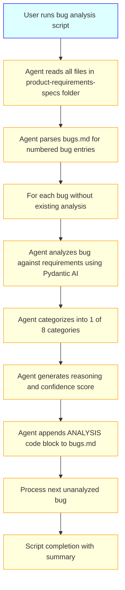
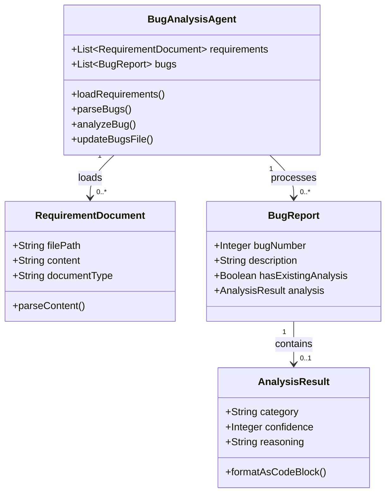

# Business & Functional Requirements

## 1. Purpose
This document defines the detailed business and functional requirements for building an AI-powered Bug Analysis Agent that automatically categorizes bug reports against product requirements using Pydantic AI, eliminating manual triage effort for development teams.

## 2. Scope
- **In-Scope:**  
    - Python script using Pydantic AI for bug analysis
    - File processing from `product-requirements-specs` folder and `bugs.md`
    - 8-category bug classification with reasoning and confidence scoring
    - Direct markdown file updates with analysis results
    - 12-hour rapid prototype implementation
- **Out-of-Scope:**  
    - Web interfaces, dashboards, or GUI components
    - Integration with external bug tracking systems (JIRA, Azure DevOps)
    - Statistics, analytics, or reporting features
    - Multi-project or enterprise features

## 3. Stakeholders
- **Primary:** Software Development Teams (developers, QA engineers, technical leads)
- **Secondary:** Project Managers, Product Owners who need consistent bug categorization

## 4. Key Use Cases

### Use Case UC-001: Process Bug Reports
**Description:** Agent reads product requirements and analyzes bugs to provide categorization with reasoning.
**Actors:** Developer, QA Engineer, Technical Lead
**Preconditions:** 
- `product-requirements-specs` folder exists with requirement documents
- `bugs.md` file exists with numbered bug list
- Python environment with Pydantic AI available

**Main Flow:**


**Alternate Flows:**
- **Skip Existing Analysis:** If bug already has ANALYSIS block, skip to next bug
- **Missing Requirements:** If requirements folder is empty, log error and exit
- **Invalid Bug Format:** If bugs.md doesn't contain numbered list, log error and exit
- **AI Analysis Failure:** If Pydantic AI fails, mark bug as "Needs Human Review" with error reasoning

## 5. Functional Requirements

### Input Processing Requirements
1. **FR-001:** Agent SHALL read all markdown files (.md) from `product-requirements-specs` folder recursively
2. **FR-002:** Agent SHALL parse files containing PRDs, functional specs, user stories, acceptance criteria, use cases, business rules, release notes, and API contracts
3. **FR-003:** Agent SHALL parse `bugs.md` file and extract numbered list items (format: "1. Bug description", "2. Next bug", etc.)
4. **FR-004:** Agent SHALL identify bugs that already have ANALYSIS code blocks and skip them

### Analysis Requirements  
5. **FR-005:** Agent SHALL use Pydantic AI to analyze each bug against the complete requirements knowledge base
6. **FR-006:** Agent SHALL categorize each bug into exactly one of these 8 categories:
    - Change Request
    - Valid Defect
    - Requirement Ambiguity  
    - Requirement Gap
    - Enhancement Disguised as Bug
    - Duplicate/Known Issue
    - Documentation Issue
    - Needs Human Review
7. **FR-007:** Agent SHALL generate confidence score from 0-100% for each categorization
8. **FR-008:** Agent SHALL provide detailed reasoning explaining the categorization decision

### Output Requirements
9. **FR-009:** Agent SHALL append analysis results as code blocks immediately after each bug entry
10. **FR-010:** Analysis block SHALL use this exact format:
```
ANALYSIS:
Category: [Category Name]
Confidence: [0-100%]
Reasoning: [Detailed explanation with requirement references where applicable]
```
11. **FR-011:** Agent SHALL modify `bugs.md` file in-place, preserving all existing content
12. **FR-012:** Agent SHALL never overwrite existing ANALYSIS blocks (skip existing behavior)

### Performance Requirements
13. **FR-013:** Agent SHALL complete analysis of typical bug reports (20-50 bugs) within 2 minutes
14. **FR-014:** Agent SHALL handle requirement documents up to 100MB total size
15. **FR-015:** Agent SHALL provide meaningful error messages for file access or parsing failures

### Advanced Processing Requirements  
16. **FR-016:** Agent SHALL accept any markdown format in requirement documents without validation
17. **FR-017:** Agent SHALL detect multiple issues within a single numbered bug entry and analyze each issue separately
### Advanced Processing Requirements  
16. **FR-016:** Agent SHALL accept any markdown format in requirement documents without validation
17. **FR-017:** Agent SHALL detect multiple issues within a single numbered bug entry and analyze each issue separately
18. **FR-018:** Agent SHALL create separate ANALYSIS blocks for each issue found within a single bug entry
19. **FR-019:** Agent SHALL provide detailed logging for debugging including: file processing steps, bug parsing results, AI analysis inputs/outputs, and categorization decisions with timestamps

## 6. Acceptance Criteria

**FR-001 / UC-001:**  
  - AC1: Agent successfully reads all .md files from requirements folder including subdirectories
  - AC2: Agent handles missing requirements folder gracefully with clear error message
  - AC3: Agent processes empty requirements folder and logs warning

**FR-003 / UC-001:**  
  - AC1: Agent correctly parses numbered list format (1. 2. 3. etc.)
  - AC2: Agent handles multi-line bug descriptions spanning multiple lines
  - AC3: Agent ignores non-numbered content in bugs.md file
  - AC4: Agent provides clear error if no numbered bugs found

**FR-006 / UC-001:**  
  - AC1: Every analyzed bug receives exactly one of the 8 defined categories
  - AC2: Category assignment is consistent for identical bugs across multiple runs
  - AC3: Agent uses "Needs Human Review" for ambiguous cases where confidence < 50%

**FR-009-012 / UC-001:**  
  - AC1: ANALYSIS blocks appear immediately after each bug entry with proper formatting
  - AC2: Existing ANALYSIS blocks are never modified or overwritten
  - AC3: Original bug content remains unchanged
  - AC4: Generated markdown remains properly formatted and readable

**FR-016-019 / UC-001:**
  - AC1: Agent accepts any valid markdown files regardless of structure or formatting
  - AC2: Agent detects multiple issues in single bug entry (e.g., "Login fails AND password reset broken")
  - AC3: Each detected issue gets separate ANALYSIS block with clear numbering (e.g., Issue 1, Issue 2)
  - AC4: Logging output enables tracing any categorization decision from input to final result
  - AC5: Log files include timestamps, file paths, analysis reasoning, and confidence calculations

## 7. Non-Functional Requirements
- **Performance:** Process 50+ bugs within 2 minutes on standard developer machine
- **Reliability:** Handle file I/O errors gracefully without corrupting bugs.md
- **Usability:** Single command execution with clear progress indication and error messages
- **Maintainability:** Clean Python code structure enabling easy category logic modifications

## 8. Data Models & Entities



## 9. Business Rules & Constraints
- **Rule 1:** Analysis SHALL only be performed on bugs without existing ANALYSIS blocks
- **Rule 2:** Confidence scores below 50% MUST result in "Needs Human Review" category (fixed threshold)
- **Rule 3:** All requirement document types (PRDs, user stories, etc.) have equal weight in analysis
- **Rule 4:** Original bugs.md formatting and content MUST be preserved exactly
- **Rule 5:** Any markdown format is acceptable for requirement documents - no validation required
- **Rule 6:** Single bug entries containing multiple issues SHALL be split and analyzed separately
- **Rule 7:** Each detected issue within a bug entry gets its own numbered ANALYSIS block

## 10. Assumptions & Dependencies
- **Assumptions:** 
    - Requirements documents are in markdown format but can have any structure
    - Bug descriptions contain sufficient detail for meaningful analysis
    - Development team has Python 3.8+ environment available
    - Multiple issues within single bug entry can be detected through natural language processing
- **Dependencies:** 
    - Pydantic AI library availability and API access
    - File system read/write permissions for project directory
    - Logging framework for detailed debugging output

## 11. Glossary
- **Bug Report:** Numbered item in bugs.md describing a software issue or unexpected behavior
- **Requirements Specs:** Collection of documents defining product functionality, user stories, acceptance criteria
- **Analysis Block:** Code-formatted section containing categorization results appended to bug entries
- **Pydantic AI:** AI library used for structured data analysis and validation
- **Multi-Issue Bug:** Single numbered entry containing multiple distinct problems requiring separate analysis
- **Issue Splitting:** Process of detecting and analyzing multiple problems within a single bug entry