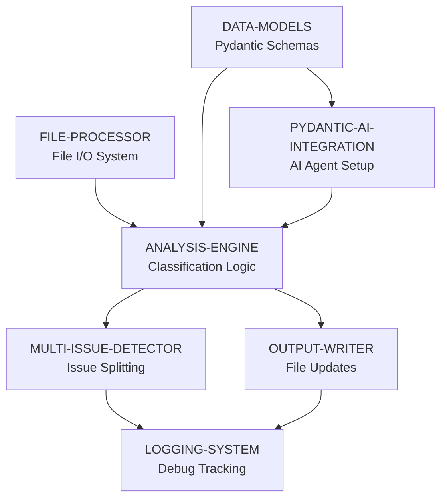

# Implementation Roadmap

## 1. Overview
- **Purpose:** Build sequence for Analyze-It Bug Analysis Agent
- **Approach:** Dependency-driven component sequencing for 12-hour rapid prototype
- **Milestones:** 3 key deliverable milestones over 12 hours

## 2. Components

### Foundation Components (Build First)
- **FILE-PROCESSOR:** Markdown file reading and parsing system for requirements and bugs
- **DATA-MODELS:** Pydantic models for bugs, requirements, and analysis results

### Core Components (Build Second)  
- **PYDANTIC-AI-INTEGRATION:** AI agent setup and configuration for bug analysis
- **ANALYSIS-ENGINE:** 8-category classification logic with confidence scoring (needs FILE-PROCESSOR, DATA-MODELS)

### Feature Components (Build Third)
- **MULTI-ISSUE-DETECTOR:** Logic to split compound bugs into separate issues (needs ANALYSIS-ENGINE)
- **OUTPUT-WRITER:** Markdown file update system with ANALYSIS block formatting (needs ANALYSIS-ENGINE)
- **LOGGING-SYSTEM:** Detailed debugging and traceability logging (needs all components)

## 3. Build Sequence

## 4. Build Milestones

### Milestone 1: Foundation Ready (Hours 0-4)
**Components:** FILE-PROCESSOR, DATA-MODELS, PYDANTIC-AI-INTEGRATION
**What You Get:** Basic file reading, data structures, and AI agent connection operational
**Why First:** Everything else depends on these core capabilities
**Success Criteria:**
- ✅ Read all files from `product-requirements-specs` folder recursively
- ✅ Parse `bugs.md` and extract numbered bug entries
- ✅ Pydantic models defined for all data structures
- ✅ Pydantic AI agent initialized and responding to test queries
- ✅ Basic error handling for missing files and folders
**Parallel Work:** FILE-PROCESSOR + DATA-MODELS can be built simultaneously (2 developers)

### Milestone 2: Core Analysis Working (Hours 4-8)  
**Components:** ANALYSIS-ENGINE, MULTI-ISSUE-DETECTOR
**What You Get:** Bug categorization and multi-issue detection operational
**Why Second:** Need foundation components and AI integration to be complete
**Success Criteria:**
- ✅ 8-category classification working with confidence scoring
- ✅ AI analysis generates reasoning for each categorization
- ✅ Multi-issue detection identifies compound bugs like "Login fails AND password reset broken"
- ✅ Skip existing ANALYSIS blocks functionality working
- ✅ Confidence threshold rule (< 50% = "Needs Human Review") enforced
**Parallel Work:** ANALYSIS-ENGINE core logic + MULTI-ISSUE-DETECTOR can be developed simultaneously

### Milestone 3: Complete System Operational (Hours 8-12)
**Components:** OUTPUT-WRITER, LOGGING-SYSTEM  
**What You Get:** Full end-to-end bug analysis with file updates and debugging
**Why Last:** Need core analysis components to be complete
**Success Criteria:**
- ✅ ANALYSIS blocks written to bugs.md with exact specified format
- ✅ Original file content preserved exactly
- ✅ Comprehensive logging with timestamps and decision traceability
- ✅ Script handles 20-50 bugs within 2 minutes
- ✅ Error handling for all edge cases (empty folders, invalid formats, AI failures)
**Parallel Work:** OUTPUT-WRITER + LOGGING-SYSTEM can be built simultaneously

## 5. Parallel Development

### What Can Be Built Together:
- **Milestone 1:** FILE-PROCESSOR + DATA-MODELS + PYDANTIC-AI-INTEGRATION (3 developers max)
- **Milestone 2:** ANALYSIS-ENGINE + MULTI-ISSUE-DETECTOR (2 developers)  
- **Milestone 3:** OUTPUT-WRITER + LOGGING-SYSTEM (2 developers)

### What Must Be Sequential:
- Foundation → Core → Features (milestones cannot overlap significantly)
- PYDANTIC-AI-INTEGRATION must complete before ANALYSIS-ENGINE starts
- ANALYSIS-ENGINE must be functional before OUTPUT-WRITER begins

## 6. Detailed Component Breakdown

### FILE-PROCESSOR (Foundation)
**Dependencies:** None
**Parallel Safe:** Yes
**Build Time:** 1.5 hours
**Key Functions:**
- `load_requirements_folder()` - Recursively read all .md files
- `parse_bugs_file()` - Extract numbered bug entries
- `detect_existing_analysis()` - Check for ANALYSIS blocks

### DATA-MODELS (Foundation)  
**Dependencies:** None
**Parallel Safe:** Yes
**Build Time:** 1 hour
**Key Classes:**
- `RequirementDocument` - File path, content, metadata
- `BugReport` - Number, description, existing analysis flag
- `AnalysisResult` - Category, confidence, reasoning
- `BugAnalysisAgent` - Main orchestrator

### PYDANTIC-AI-INTEGRATION (Foundation)
**Dependencies:** DATA-MODELS
**Parallel Safe:** With DATA-MODELS
**Build Time:** 1.5 hours  
**Key Functions:**
- `initialize_ai_agent()` - Setup Pydantic AI connection
- `create_analysis_prompt()` - Format requirements + bug for AI
- `parse_ai_response()` - Extract category, confidence, reasoning

### ANALYSIS-ENGINE (Core)
**Dependencies:** All Foundation components
**Parallel Safe:** No (needs foundation complete)
**Build Time:** 3 hours
**Key Functions:**
- `analyze_single_bug()` - Core classification logic
- `apply_confidence_rules()` - Enforce 50% threshold
- `validate_category()` - Ensure one of 8 categories
- `generate_reasoning()` - Create detailed explanations

### MULTI-ISSUE-DETECTOR (Core)
**Dependencies:** ANALYSIS-ENGINE structure
**Parallel Safe:** With ANALYSIS-ENGINE
**Build Time:** 1 hour
**Key Functions:**
- `detect_multiple_issues()` - Split compound bugs
- `create_issue_variants()` - Generate separate analysis requests
- `number_analysis_blocks()` - Handle Issue 1, Issue 2 formatting

### OUTPUT-WRITER (Features)
**Dependencies:** ANALYSIS-ENGINE, MULTI-ISSUE-DETECTOR  
**Parallel Safe:** With LOGGING-SYSTEM
**Build Time:** 2 hours
**Key Functions:**
- `format_analysis_block()` - Create exact ANALYSIS format
- `insert_into_markdown()` - Preserve original formatting
- `backup_original_file()` - Safety before modification

### LOGGING-SYSTEM (Features)
**Dependencies:** All previous components
**Parallel Safe:** With OUTPUT-WRITER
**Build Time:** 2 hours
**Key Functions:**
- `log_file_processing()` - Track file operations
- `log_analysis_decision()` - Record AI reasoning process
- `log_performance_metrics()` - Track timing and throughput

## 7. Risk Mitigation

### High-Risk Dependencies:
- **Pydantic AI API availability** - Have backup simple rule-based logic ready
- **File I/O complexity** - Start with basic read/write, enhance incrementally  
- **Multi-issue detection accuracy** - Begin with simple AND/OR keyword detection

### Critical Path:
Foundation → ANALYSIS-ENGINE → OUTPUT-WRITER forms the critical path for basic functionality.
MULTI-ISSUE-DETECTOR and LOGGING-SYSTEM are enhancement features that can be simplified if time runs short.

## 8. Success Metrics by Milestone

### Milestone 1 Success:
- Files load without errors
- Basic AI connection established  
- Data flows through system without crashes

### Milestone 2 Success:
- At least 80% accuracy on sample bugs
- All 8 categories working
- Multi-issue detection finds obvious compound bugs

### Milestone 3 Success:
- End-to-end processing of 10+ sample bugs
- Files updated correctly without corruption
- Detailed logs enable debugging any issues

## 9. Fallback Plans

**If Behind Schedule at Hour 4:** Skip MULTI-ISSUE-DETECTOR, focus on core analysis
**If Behind Schedule at Hour 8:** Simplify LOGGING-SYSTEM to basic print statements
**If AI Integration Fails:** Implement rule-based classification using keyword matching

**Minimum Viable Product:** FILE-PROCESSOR + ANALYSIS-ENGINE + OUTPUT-WRITER = Core bug categorization working