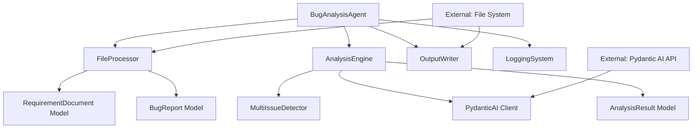
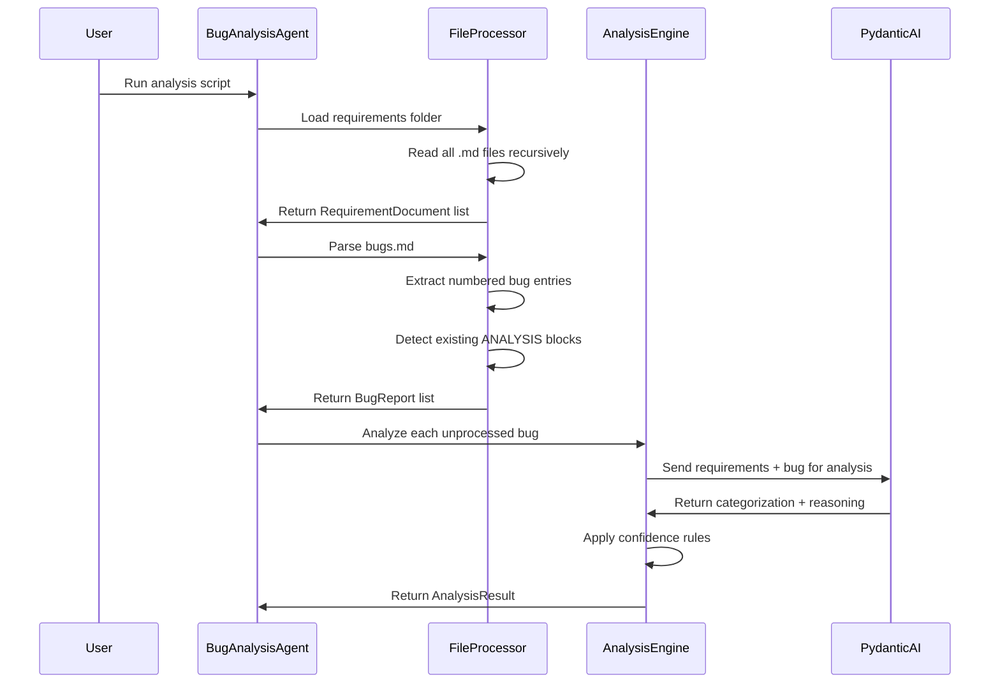
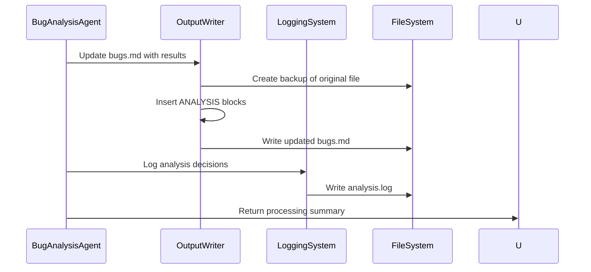

# COMPLETE-BUG-ANALYSIS-AGENT Integration Guide

## 1. Module Overview
The Complete Bug Analysis Agent is a standalone Python script that operates independently within a project directory structure. This Phase 1 implementation has minimal external dependencies and integrates primarily through file system operations.

## 2. Dependencies

### External Dependencies
This module depends on external systems and services:

**Pydantic AI Service:**
- **What it provides:** AI-powered bug categorization and reasoning
- **How we use it:** Send structured prompts, receive categorized analysis 
- **Integration points:** RESTful API calls with structured request/response
- **Failure handling:** Retry logic, fallback to "Needs Human Review"

**File System:**
- **What it provides:** Access to requirement documents and bug reports
- **How we use it:** Read requirements folder, read/write bugs.md file
- **Integration points:** Standard file I/O operations with proper error handling
- **Failure handling:** Graceful degradation with meaningful error messages

**Python Runtime Environment:**
- **What it provides:** Core execution environment and standard libraries
- **How we use it:** Pathlib for file operations, logging for debugging, regex for parsing
- **Integration points:** Standard library APIs
- **Requirements:** Python 3.8+ with pip package management

### Internal Dependencies
This module contains internal components with clear dependency relationships:



## 3. Dependents

### Phase 1 Dependents
In Phase 1, this is a standalone module with no other modules depending on it:

**Project Files:**
- **What depends on us:** Development team workflow
- **What we provide:** Updated bugs.md with analysis results
- **Integration method:** Direct file modification with analysis blocks
- **Usage pattern:** Run script when new bugs are added or requirements change

**Development Process:**
- **What depends on us:** Bug triage and sprint planning decisions  
- **What we provide:** Consistent categorization with evidence-based reasoning
- **Integration method:** Human review of ANALYSIS blocks in bugs.md
- **Usage pattern:** Pre-sprint planning analysis and ongoing bug assessment

### Future Phase Dependents
Potential future modules that could depend on this system:

**Bug Tracking System Integration:**
- **Potential dependency:** JIRA/Azure DevOps connector module
- **What they would need:** Categorization API and structured results
- **Integration approach:** Export analysis results to external systems
- **Current limitation:** Phase 1 only supports file-based operation

**Reporting Dashboard:**
- **Potential dependency:** Analytics and metrics module
- **What they would need:** Historical categorization data and trends
- **Integration approach:** Database storage of analysis results
- **Current limitation:** Phase 1 has no data persistence beyond file updates

## 4. Integration Points

### File System Integration
**Input Integration:**
```
Project Structure:
project-root/
├── product-requirements-specs/
│   ├── prd.md
│   ├── user-stories/
│   ├── acceptance-criteria/
│   └── api-contracts/
├── bugs.md
└── bug_analyzer.py
```

**Expected File Formats:**
- **Requirements:** Any markdown (.md) files with product specifications
- **Bugs:** Numbered list format in bugs.md (1. Description, 2. Next bug, etc.)
- **Output:** ANALYSIS code blocks appended to bugs.md

**File Access Patterns:**
- **Read Access:** Recursive reading of all .md files in requirements folder
- **Write Access:** In-place modification of bugs.md with backup creation
- **Permission Requirements:** Read access to requirements folder, read/write to bugs.md

### API Integration (Pydantic AI)

**Authentication:**
```python
# Environment variable configuration
export PYDANTIC_AI_API_KEY="your-api-key-here"

# Configuration in code
import os
api_key = os.getenv('PYDANTIC_AI_API_KEY')
ai_agent = Agent(api_key=api_key)
```

**Request/Response Format:**
```python
# Analysis Request Structure
{
    "prompt": "System prompt + requirements context + bug description",
    "model": "structured_output",
    "response_format": AnalysisResult
}

# Expected Response Structure  
{
    "category": "Valid Defect",
    "confidence": 85,
    "reasoning": "This contradicts requirement REQ-AUTH-001..."
}
```

**Error Handling:**
- **Rate Limiting:** Exponential backoff with max 3 retry attempts
- **API Failures:** Fallback to "Needs Human Review" with error details
- **Network Issues:** Graceful degradation with offline operation capability
- **Invalid Responses:** Validation and correction of malformed AI output

### Configuration Integration

**Environment Variables:**
```bash
# Required
export PYDANTIC_AI_API_KEY="api-key"

# Optional  
export BUG_ANALYZER_REQUIREMENTS_FOLDER="./requirements" 
export BUG_ANALYZER_BUGS_FILE="./issues.md"
export BUG_ANALYZER_LOG_LEVEL="INFO"
export BUG_ANALYZER_CONFIDENCE_THRESHOLD="50"
```

**Configuration File Support:**
```python
# config.json (optional)
{
    "requirements_folder": "product-requirements-specs",
    "bugs_file": "bugs.md", 
    "confidence_threshold": 50,
    "log_level": "INFO",
    "ai_retry_attempts": 3
}
```

## 5. Data Flow Architecture

### Input Data Flow:


### Output Data Flow:


## 6. Error Integration Patterns

### Error Propagation Strategy:
```python
# Graceful degradation approach
try:
    analysis_results = analyze_all_bugs(bugs, requirements)
except PydanticAIError as e:
    # Continue with rule-based fallback  
    analysis_results = fallback_analysis(bugs, requirements)
    log_error(f"AI analysis failed, using fallback: {e}")

except FileSystemError as e:
    # Partial processing where possible
    partial_results = process_available_files()
    log_error(f"File access limited: {e}")
    return partial_results

except CriticalError as e:
    # Fail fast for unrecoverable errors
    log_critical(f"Cannot continue: {e}")
    sys.exit(1)
```

### Recovery Mechanisms:
- **File Corruption:** Automatic backup restoration
- **Partial AI Failures:** Continue processing remaining bugs
- **Network Interruptions:** Resume from last successful analysis
- **Invalid Input:** Skip problematic entries with detailed logging

## 7. Performance Integration Considerations

### Resource Management:
```python
# Memory-conscious processing
def process_large_requirements_folder():
    """Stream large files instead of loading everything in memory"""
    for requirement_file in iterate_requirements():
        content = read_file_streaming(requirement_file)
        yield process_content(content)
        
# API Rate Limiting  
async def analyze_bugs_batch(bugs: List[BugReport]):
    """Batch API calls to respect rate limits"""
    semaphore = asyncio.Semaphore(max_concurrent=5)
    tasks = [analyze_single_bug(bug, semaphore) for bug in bugs]
    return await asyncio.gather(*tasks)
```

### Performance Monitoring:
```python
# Built-in performance tracking
@performance_monitor
def analyze_bug(bug: BugReport) -> AnalysisResult:
    """Analysis with automatic timing and metrics"""
    start_time = time.time()
    result = ai_agent.analyze(bug)
    duration = time.time() - start_time
    
    metrics.record_analysis_time(duration)
    metrics.record_bug_processed()
    
    return result
```

## 8. Testing Integration

### Test Data Requirements:
```
test-data/
├── sample-requirements/
│   ├── sample-prd.md
│   ├── sample-user-stories.md
│   └── sample-acceptance-criteria.md
├── sample-bugs.md
├── expected-results.json
└── integration-test-cases/
    ├── missing-files-scenario/
    ├── ai-failure-scenario/
    └── large-project-scenario/
```

### Integration Test Patterns:
```python
def test_end_to_end_analysis():
    """Test complete workflow with realistic data"""
    # Setup test environment
    setup_test_project("sample-project")
    
    # Run analysis
    result = run_bug_analyzer("test-data/")
    
    # Verify outputs
    assert_bugs_file_updated_correctly()
    assert_analysis_blocks_formatted_properly()
    assert_processing_completed_successfully()
    
def test_external_integration():
    """Test Pydantic AI integration"""
    mock_ai_service()
    result = analyze_sample_bug()
    assert_ai_called_with_correct_format()
    assert_response_parsed_correctly()
```

## 9. Deployment Integration

### Installation Requirements:
```bash
# System requirements
python >= 3.8
pip >= 21.0

# Installation process
git clone <repository>
cd analyze-it
python -m venv venv
source venv/bin/activate
pip install -r requirements.txt

# Configuration
export PYDANTIC_AI_API_KEY="your-key"
```

### Runtime Integration:
```bash
# Direct execution
cd project-directory  
python path/to/bug_analyzer.py

# Integrated with CI/CD
- name: Analyze Bugs
  run: |
    python bug_analyzer.py
    git add bugs.md
    git commit -m "Update bug analysis" || true
```

## 10. Monitoring and Observability

### Logging Integration:
```python
# Structured logging for integration monitoring
logger.info("analysis_started", extra={
    "requirements_files": len(requirements),
    "bugs_count": len(bugs),
    "timestamp": datetime.utcnow().isoformat()
})

logger.info("analysis_completed", extra={
    "processed_bugs": results.processed_count,
    "skipped_bugs": results.skipped_count,
    "execution_time": results.duration,
    "success_rate": results.success_percentage
})
```

### Health Check Integration:
```python
def health_check() -> Dict[str, Any]:
    """Provide integration health status"""
    return {
        "pydantic_ai_connection": test_ai_connectivity(),
        "file_system_access": test_file_permissions(),
        "requirements_folder": check_requirements_availability(),
        "bugs_file": check_bugs_file_status(),
        "last_successful_run": get_last_run_timestamp()
    }
```

## 11. Migration and Upgrade Considerations

### Data Migration (Future Phases):
```python
# Phase 1 -> Phase 2 migration support
def migrate_file_based_to_database():
    """Convert file-based operation to database storage"""
    # Read existing analysis from bugs.md
    # Extract structured data
    # Store in database with version control
    pass

def preserve_analysis_history():
    """Maintain historical analysis data"""
    # Backup existing ANALYSIS blocks
    # Version control analysis changes
    # Enable rollback capability
    pass
```

### Backward Compatibility:
- **File Format:** Maintain bugs.md compatibility across versions
- **Configuration:** Support legacy environment variable names
- **API Contracts:** Stable internal interfaces for future module integration

This integration guide provides the foundation for connecting the Bug Analysis Agent with external systems and future enhancements while maintaining the simplicity and reliability required for the Phase 1 rapid prototype.