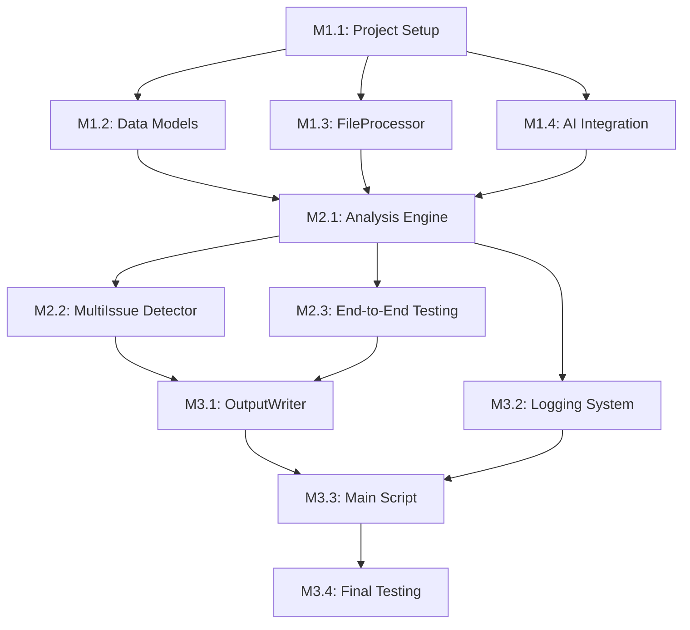

# COMPLETE-BUG-ANALYSIS-AGENT - Phase 1 Development Tasks

## 1. Task Overview

### Timeline: 12 Hours (3 Milestones x 4 Hours Each)
### Approach: Sequential milestone completion with parallel subtasks
### Deliverable: Working bug analysis script with full functionality

## 2. Milestone 1: Foundation Setup (Hours 0-4)

### M1.1 Project Structure Setup (30 minutes)
**Priority:** Critical  
**Dependencies:** None  
**Estimated Time:** 30 minutes

**Tasks:**
- [ ] Create project directory structure
- [ ] Set up Python virtual environment
- [ ] Install Pydantic AI and dependencies
- [ ] Create requirements.txt file
- [ ] Initialize Git repository with .gitignore

**Acceptance Criteria:**
- Directory structure matches technical specification
- All dependencies installed and tested
- Virtual environment activated and working
- Initial commit created

**Implementation Steps:**
```bash
mkdir -p analyze-it/{models,components,tests}
cd analyze-it
python -m venv venv
source venv/bin/activate  # or venv\Scripts\activate on Windows
pip install pydantic-ai pydantic pathlib
pip freeze > requirements.txt
```

### M1.2 Data Models Implementation (90 minutes)
**Priority:** Critical  
**Dependencies:** Project structure complete  
**Estimated Time:** 90 minutes

**Tasks:**
- [ ] Implement BugCategory enum with 8 categories
- [ ] Create RequirementDocument model with Pydantic
- [ ] Create BugReport model with issue detection placeholder
- [ ] Create Issue model for multi-issue handling
- [ ] Create AnalysisResult model with formatting method
- [ ] Create ProcessingResult model for summary
- [ ] Add type hints and docstrings
- [ ] Write unit tests for all models

**Acceptance Criteria:**
- All models validate input correctly
- AnalysisResult.format_as_code_block() produces correct markdown
- Models handle edge cases (empty strings, invalid enums)
- Unit tests achieve 90%+ coverage on models

**Implementation Priority:**
1. BugCategory enum (15 min)
2. AnalysisResult with formatting (30 min)
3. BugReport basic structure (20 min)
4. RequirementDocument (15 min) 
5. Issue and ProcessingResult (10 min)

### M1.3 FileProcessor Implementation (90 minutes)
**Priority:** Critical  
**Dependencies:** Data models complete  
**Estimated Time:** 90 minutes

**Tasks:**
- [ ] Implement load_requirements() method
- [ ] Add recursive .md file discovery
- [ ] Create parse_bugs_file() method
- [ ] Add numbered list parsing with regex
- [ ] Implement detect_existing_analysis() method
- [ ] Add robust error handling for file operations
- [ ] Create file access permission checking
- [ ] Write comprehensive unit tests

**Acceptance Criteria:**
- Loads all .md files from requirements folder recursively
- Correctly parses numbered bugs from bugs.md
- Detects existing ANALYSIS blocks accurately
- Handles missing files/folders gracefully
- Provides meaningful error messages

**Implementation Priority:**
1. Basic file reading (load_requirements) (30 min)
2. Bug parsing (parse_bugs_file) (40 min)
3. Analysis detection (detect_existing_analysis) (20 min)

### M1.4 Pydantic AI Integration Setup (90 minutes)
**Priority:** Critical  
**Dependencies:** Data models complete  
**Estimated Time:** 90 minutes

**Tasks:**
- [ ] Configure Pydantic AI agent with system prompt
- [ ] Create analysis request/response models
- [ ] Implement basic AI communication flow
- [ ] Add error handling for AI failures
- [ ] Create retry logic with exponential backoff
- [ ] Test AI integration with sample data
- [ ] Add configuration for API keys
- [ ] Write integration tests

**Acceptance Criteria:**
- AI agent responds to test prompts correctly
- Structured output matches AnalysisResult model
- Error handling works for API failures
- Configuration supports environment variables
- Retry logic prevents script crashes

**Implementation Priority:**
1. Basic AI agent setup (30 min)
2. System prompt configuration (20 min)
3. Request/response handling (25 min)
4. Error handling and retries (15 min)

## 3. Milestone 2: Core Analysis Engine (Hours 4-8)

### M2.1 AnalysisEngine Core Logic (120 minutes)
**Priority:** Critical  
**Dependencies:** Foundation complete  
**Estimated Time:** 120 minutes

**Tasks:**
- [ ] Implement analyze_bug() main method
- [ ] Create _create_analysis_prompt() for AI input
- [ ] Add _apply_confidence_rules() for threshold enforcement  
- [ ] Implement category validation logic
- [ ] Add requirements context summarization
- [ ] Create AI response parsing and validation
- [ ] Add comprehensive logging for decisions
- [ ] Write integration tests with mock AI

**Acceptance Criteria:**
- Analyzes single-issue bugs correctly
- Enforces 50% confidence threshold rule
- Validates all AI responses against expected format
- Produces consistent results for identical inputs
- Logs all analysis decisions with reasoning

**Implementation Priority:**
1. Basic analyze_bug structure (30 min)
2. AI prompt creation (25 min)
3. Confidence rules enforcement (20 min)
4. Response validation (25 min)
5. Requirements context handling (20 min)

### M2.2 MultiIssueDetector Implementation (60 minutes)
**Priority:** High  
**Dependencies:** Analysis engine structure  
**Estimated Time:** 60 minutes

**Tasks:**
- [ ] Implement detect_issues() main method
- [ ] Create conjunction pattern matching
- [ ] Add sentence boundary detection
- [ ] Implement issue validation logic
- [ ] Create false-positive filtering
- [ ] Add comprehensive test cases
- [ ] Integrate with BugReport model

**Acceptance Criteria:**
- Detects obvious compound bugs ("X fails AND Y breaks")
- Avoids false splits on normal conjunctions
- Returns meaningful separate issue descriptions
- Handles edge cases gracefully (single issue, no conjunctions)
- Integrates seamlessly with analysis workflow

**Implementation Priority:**
1. Basic conjunction detection (20 min)
2. Pattern matching refinement (20 min)
3. Validation and filtering (20 min)

### M2.3 End-to-End Analysis Testing (60 minutes)
**Priority:** High  
**Dependencies:** Analysis engine + Multi-issue detector  
**Estimated Time:** 60 minutes

**Tasks:**
- [ ] Create comprehensive test dataset
- [ ] Test single-issue bug analysis
- [ ] Test multi-issue bug handling
- [ ] Validate confidence scoring accuracy
- [ ] Test all 8 category classifications
- [ ] Verify error handling scenarios
- [ ] Performance test with 20+ bugs
- [ ] Document any accuracy issues

**Acceptance Criteria:**
- Processes test dataset without errors
- Achieves reasonable accuracy on known test cases
- Handles all categories appropriately
- Multi-issue detection works on compound bugs
- Performance meets 2-minute target for 20+ bugs

## 4. Milestone 3: Complete System (Hours 8-12)

### M3.1 OutputWriter Implementation (90 minutes)
**Priority:** Critical  
**Dependencies:** Analysis engine working  
**Estimated Time:** 90 minutes

**Tasks:**
- [ ] Implement update_bugs_file() main method
- [ ] Create _insert_analysis_blocks() for precise placement
- [ ] Add file backup functionality
- [ ] Implement markdown formatting preservation
- [ ] Add multi-issue ANALYSIS block handling
- [ ] Create robust file update error handling
- [ ] Test with various bug.md formats
- [ ] Write comprehensive unit tests

**Acceptance Criteria:**
- Updates bugs.md without corrupting content
- Preserves all original formatting exactly
- Places ANALYSIS blocks in correct locations
- Handles multiple issues with proper numbering
- Creates backup before modifications
- Recovers gracefully from write failures

**Implementation Priority:**
1. Basic file update mechanism (30 min)
2. Analysis block insertion logic (35 min) 
3. Backup and error handling (25 min)

### M3.2 LoggingSystem Implementation (60 minutes)
**Priority:** Medium  
**Dependencies:** Other components functional  
**Estimated Time:** 60 minutes

**Tasks:**
- [ ] Set up comprehensive logging framework
- [ ] Implement file processing logging
- [ ] Add analysis decision logging
- [ ] Create performance metrics logging
- [ ] Configure log levels and formatting
- [ ] Add timestamp and traceability
- [ ] Test logging output readability
- [ ] Configure log file rotation

**Acceptance Criteria:**
- Logs enable tracing any categorization decision
- Includes timestamps, file paths, AI inputs/outputs
- Performance metrics track timing and throughput
- Log files remain readable and well-formatted
- Debug level provides sufficient detail for troubleshooting

**Implementation Priority:**
1. Basic logging setup (20 min)
2. Analysis decision logging (25 min)
3. Performance and formatting (15 min)

### M3.3 Main Script and CLI Integration (60 minutes)
**Priority:** Critical  
**Dependencies:** All components complete  
**Estimated Time:** 60 minutes

**Tasks:**
- [ ] Create bug_analyzer.py main entry point
- [ ] Implement command-line argument parsing
- [ ] Add progress indication for long operations
- [ ] Create configuration management
- [ ] Implement error handling and user messages
- [ ] Add help text and usage examples
- [ ] Test full end-to-end workflow
- [ ] Create README with installation/usage

**Acceptance Criteria:**
- Script runs with single command execution
- Provides clear progress indication during processing
- Error messages are helpful for common issues
- Configuration supports custom file paths
- Help text explains all available options
- README enables new user to get started quickly

**Implementation Priority:**
1. Basic CLI structure (20 min)
2. Component integration (25 min)
3. Error handling and help (15 min)

### M3.4 Final Integration and Testing (90 minutes)
**Priority:** Critical  
**Dependencies:** All components implemented  
**Estimated Time:** 90 minutes

**Tasks:**
- [ ] Create realistic test project with requirements and bugs
- [ ] Run full end-to-end processing test
- [ ] Validate output quality and accuracy
- [ ] Test error scenarios (missing files, AI failures)
- [ ] Performance test with target bug volumes (20-50 bugs)
- [ ] Create demonstration script and sample data
- [ ] Document any limitations or known issues
- [ ] Finalize README and deployment instructions

**Acceptance Criteria:**
- Processes realistic project data successfully
- Meets performance targets (50 bugs in 2 minutes)
- Error handling works for all tested scenarios
- Output quality suitable for development teams
- Documentation enables immediate usage
- Demonstration shows clear value proposition

## 5. Task Dependencies Map



## 6. Parallel Development Opportunities

### Milestone 1 (Hours 0-4):
- **Parallel Track A:** M1.1 → M1.2 (Project setup → Data models)
- **Parallel Track B:** M1.3 (FileProcessor)  
- **Parallel Track C:** M1.4 (AI Integration)
- **Note:** Tracks B and C can start after Track A completes M1.1

### Milestone 2 (Hours 4-8):
- **Sequential:** M2.1 must complete before M2.2 starts
- **Parallel:** M2.3 can run partially parallel with M2.2 completion

### Milestone 3 (Hours 8-12):
- **Parallel Track A:** M3.1 (OutputWriter)
- **Parallel Track B:** M3.2 (LoggingSystem)
- **Sequential:** M3.3 needs both A and B complete
- **Sequential:** M3.4 needs everything complete

## 7. Quality Gates

### Milestone 1 Gate:
- [ ] All unit tests pass
- [ ] FileProcessor loads sample requirements successfully
- [ ] AI integration responds to test prompt
- [ ] No critical errors in basic functionality

### Milestone 2 Gate:
- [ ] Analysis engine categorizes sample bugs correctly
- [ ] Multi-issue detection works on compound bugs
- [ ] Confidence threshold rules enforced
- [ ] End-to-end test completes without errors

### Milestone 3 Gate:
- [ ] Complete workflow processes test project successfully
- [ ] Output format matches specification exactly
- [ ] Performance targets met (speed, accuracy)
- [ ] Error handling works for all tested scenarios
- [ ] Documentation complete and accurate

## 8. Risk Mitigation Tasks

### High-Risk Items:
1. **Pydantic AI Integration Failure**
   - **Backup Plan:** Implement simple rule-based classification
   - **Test Early:** M1.4 includes immediate AI connectivity test

2. **Multi-Issue Detection Complexity**
   - **Backup Plan:** Skip feature if implementation time exceeds budget
   - **Simple Alternative:** Basic AND/OR keyword detection

3. **File Processing Edge Cases**
   - **Mitigation:** Extensive test cases in M1.3
   - **Fallback:** Graceful error handling with partial processing

4. **Performance Target Misses**
   - **Optimization:** Profile in M2.3, optimize before M3.4
   - **Acceptable Degradation:** 4 minutes instead of 2 minutes

## 9. Success Criteria Summary

### Functional Success:
- [ ] Processes 20+ bugs without errors
- [ ] Categorizes bugs into all 8 categories appropriately  
- [ ] Detects and splits multi-issue bugs
- [ ] Updates bugs.md with correct ANALYSIS format
- [ ] Skips existing analysis blocks correctly

### Quality Success:
- [ ] Code follows Python best practices
- [ ] Comprehensive error handling prevents crashes
- [ ] Logging enables debugging any issue
- [ ] User documentation supports immediate usage

### Performance Success:
- [ ] Completes typical workload (20-50 bugs) within 2 minutes
- [ ] Handles up to 100MB requirements documents
- [ ] Startup time under 10 seconds
- [ ] Memory usage reasonable for target environments

This development task breakdown ensures the 12-hour timeline is achievable while delivering a fully functional bug analysis system that meets all specified requirements.