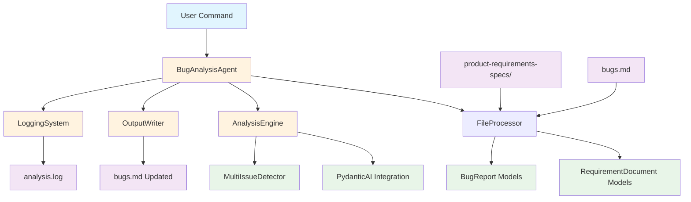

# COMPLETE-BUG-ANALYSIS-AGENT - Phase 1 Technical Specification

## 1. System Architecture

### High-Level Architecture


### Component Breakdown

#### Core Components:
- **BugAnalysisAgent:** Main orchestrator coordinating all operations
- **FileProcessor:** Handles reading requirements folder and parsing bugs.md
- **AnalysisEngine:** Manages AI integration and bug categorization logic
- **OutputWriter:** Formats and writes ANALYSIS blocks to bugs.md
- **LoggingSystem:** Provides debugging and traceability capabilities
- **MultiIssueDetector:** Identifies and splits compound bug reports

## 2. Technology Stack

### Core Technologies:
- **Python 3.8+:** Primary runtime environment
- **Pydantic AI:** AI analysis and structured data validation
- **Pathlib:** Modern file system operations
- **Logging:** Built-in Python logging framework
- **Re (Regex):** Pattern matching for bug parsing and issue detection

### Key Libraries:
```python
# Core dependencies
pydantic-ai >= 0.0.1
pydantic >= 2.0
python >= 3.8

# Standard library usage
pathlib  # File system operations
logging  # Debug and trace logging
re       # Pattern matching
typing   # Type annotations
dataclasses  # Data structures
```

## 3. Data Models

### Core Data Structures
```python
from pydantic import BaseModel
from typing import List, Optional
from pathlib import Path
from enum import Enum

class BugCategory(str, Enum):
    """8-category classification system"""
    CHANGE_REQUEST = "Change Request"
    VALID_DEFECT = "Valid Defect"
    REQUIREMENT_AMBIGUITY = "Requirement Ambiguity"
    REQUIREMENT_GAP = "Requirement Gap"
    ENHANCEMENT_DISGUISED = "Enhancement Disguised as Bug"
    DUPLICATE_KNOWN = "Duplicate/Known Issue"
    DOCUMENTATION_ISSUE = "Documentation Issue"
    NEEDS_HUMAN_REVIEW = "Needs Human Review"

class RequirementDocument(BaseModel):
    """Product requirement document representation"""
    file_path: Path
    content: str
    document_type: str  # PRD, user_story, acceptance_criteria, etc.
    
    def get_content_summary(self) -> str:
        """Return first 500 chars for AI context"""
        return self.content[:500] + "..." if len(self.content) > 500 else self.content

class BugReport(BaseModel):
    """Individual bug report from bugs.md"""
    bug_number: int
    description: str
    original_text: str
    has_existing_analysis: bool = False
    issues: List['Issue'] = []
    
    def detect_multiple_issues(self) -> List[str]:
        """Identify separate issues within description"""
        # Implementation will use pattern matching for AND, OR, ALSO, etc.
        pass

class Issue(BaseModel):
    """Individual issue within a bug report"""
    issue_number: int  # 1, 2, 3... for multiple issues in same bug
    description: str
    analysis_result: Optional['AnalysisResult'] = None

class AnalysisResult(BaseModel):
    """AI analysis output for a single issue"""
    category: BugCategory
    confidence: int  # 0-100
    reasoning: str
    
    def format_as_code_block(self, issue_num: Optional[int] = None) -> str:
        """Format as markdown code block"""
        issue_prefix = f" - Issue {issue_num}" if issue_num else ""
        return f"""```
ANALYSIS{issue_prefix}:
Category: {self.category.value}
Confidence: {self.confidence}%
Reasoning: {self.reasoning}
```"""

class ProcessingResult(BaseModel):
    """Overall processing summary"""
    total_bugs: int
    processed_bugs: int
    skipped_bugs: int
    errors: List[str]
    execution_time: float
```

## 4. Core Component Specifications

### 4.1 FileProcessor Component

```python
class FileProcessor:
    """Handles all file I/O operations"""
    
    def __init__(self, requirements_folder: Path, bugs_file: Path):
        self.requirements_folder = requirements_folder
        self.bugs_file = bugs_file
        
    def load_requirements(self) -> List[RequirementDocument]:
        """Load all .md files from requirements folder recursively"""
        # Implementation:
        # - Use pathlib.Path().rglob("*.md") for recursive search
        # - Read each file with UTF-8 encoding
        # - Create RequirementDocument models
        # - Handle file access errors gracefully
        
    def parse_bugs_file(self) -> List[BugReport]:
        """Extract numbered bug entries from bugs.md"""
        # Implementation:
        # - Read bugs.md file
        # - Use regex to find numbered list items (r"^\d+\.\s+(.+)")
        # - Handle multi-line descriptions
        # - Detect existing ANALYSIS blocks
        # - Create BugReport models
        
    def detect_existing_analysis(self, bug_text: str) -> bool:
        """Check if bug already has ANALYSIS block"""
        # Implementation: Look for ```\nANALYSIS pattern
```

### 4.2 AnalysisEngine Component

```python
from pydantic_ai import Agent

class AnalysisEngine:
    """Core AI-powered bug analysis logic"""
    
    def __init__(self, requirements: List[RequirementDocument]):
        self.requirements = requirements
        self.ai_agent = self._initialize_ai_agent()
        
    def _initialize_ai_agent(self) -> Agent:
        """Set up Pydantic AI agent with system prompt"""
        # Implementation:
        # - Create Agent with structured output (AnalysisResult)
        # - Configure system prompt with requirements context
        # - Set up 8-category classification instructions
        
    def analyze_bug(self, bug: BugReport) -> List[AnalysisResult]:
        """Analyze single bug and return results for all issues"""
        # Implementation:
        # 1. Detect multiple issues within bug description
        # 2. For each issue, create AI analysis request
        # 3. Apply confidence threshold rules (< 50% = Needs Human Review)
        # 4. Validate category assignments
        # 5. Return structured results
        
    def _create_analysis_prompt(self, issue_desc: str) -> str:
        """Format requirements + issue for AI analysis"""
        # Implementation: Combine requirements summary + issue description
        
    def _apply_confidence_rules(self, result: AnalysisResult) -> AnalysisResult:
        """Enforce business rules on AI output"""
        # Implementation: Force "Needs Human Review" if confidence < 50%
```

### 4.3 MultiIssueDetector Component

```python
class MultiIssueDetector:
    """Identifies multiple issues within single bug entries"""
    
    def detect_issues(self, bug_description: str) -> List[str]:
        """Split compound bugs into individual issues"""
        # Implementation approach:
        # - Pattern matching for conjunctions: AND, OR, ALSO, PLUS, ADDITIONALLY
        # - Sentence boundary detection for separate problems
        # - Contextual analysis to avoid false splits
        # - Return list of individual issue descriptions
        
    def _split_on_conjunctions(self, text: str) -> List[str]:
        """Split text on explicit conjunctions"""
        # Patterns: " AND ", " and ", " OR ", " also ", " plus "
        
    def _validate_split(self, issues: List[str]) -> List[str]:
        """Validate that splits create meaningful separate issues"""
        # Filter out splits that are too short or don't describe problems
```

### 4.4 OutputWriter Component

```python
class OutputWriter:
    """Handles writing analysis results back to bugs.md"""
    
    def __init__(self, bugs_file: Path):
        self.bugs_file = bugs_file
        
    def update_bugs_file(self, bugs_with_results: List[BugReport]) -> None:
        """Write ANALYSIS blocks to bugs.md preserving original content"""
        # Implementation:
        # 1. Read original bugs.md content
        # 2. For each bug with new analysis results:
        #    - Find bug location in text
        #    - Insert ANALYSIS block(s) after bug description
        #    - Preserve all original formatting
        # 3. Write updated content back to file
        # 4. Create backup before modification
        
    def _insert_analysis_blocks(self, content: str, bug: BugReport) -> str:
        """Insert ANALYSIS blocks at correct location"""
        # Find bug number pattern, insert after description
        
    def _create_backup(self) -> None:
        """Create bugs.md.backup before modification"""
```

### 4.5 LoggingSystem Component

```python
class LoggingSystem:
    """Comprehensive logging for debugging and traceability"""
    
    def __init__(self, log_file: Path):
        self.logger = self._setup_logger(log_file)
        
    def _setup_logger(self, log_file: Path) -> logging.Logger:
        """Configure detailed logging with timestamps"""
        # Implementation: File + console logging with different levels
        
    def log_file_processing(self, requirements_count: int, bugs_count: int):
        """Log file loading results"""
        
    def log_analysis_decision(self, bug_num: int, issue_num: int, 
                            ai_input: str, ai_output: AnalysisResult):
        """Log AI analysis inputs and outputs for debugging"""
        
    def log_performance_metrics(self, start_time: float, end_time: float, 
                               bugs_processed: int):
        """Log timing and throughput metrics"""
```

## 5. AI Integration Architecture

### Pydantic AI Configuration
```python
# System prompt template
ANALYSIS_SYSTEM_PROMPT = """
You are an expert software bug analyst. Analyze the reported bug against the provided product requirements and categorize it into exactly one of these categories:

1. Change Request - New functionality not in current requirements
2. Valid Defect - Actual bug contradicting documented requirements  
3. Requirement Ambiguity - Requirements unclear, multiple interpretations possible
4. Requirement Gap - Missing requirements for reported scenario
5. Enhancement Disguised as Bug - Feature request presented as defect
6. Duplicate/Known Issue - Already reported or documented issue
7. Documentation Issue - Problem with documentation, not functionality
8. Needs Human Review - Insufficient information or ambiguous case

Requirements Context:
{requirements_summary}

Provide:
- Exact category name
- Confidence score 0-100%
- Detailed reasoning with specific requirement references where applicable

If confidence < 50%, use "Needs Human Review" regardless of initial category.
"""

# Structured output model
class AIAnalysisRequest(BaseModel):
    issue_description: str
    requirements_context: str

class AIAnalysisResponse(BaseModel):
    category: BugCategory
    confidence: int
    reasoning: str
```

### Analysis workflow:
1. **Context Preparation:** Combine all requirements into summary context
2. **Issue Analysis:** Send each issue + context to Pydantic AI
3. **Response Validation:** Ensure valid category and confidence range
4. **Rule Application:** Apply 50% confidence threshold rule
5. **Result Formatting:** Convert to AnalysisResult model

## 6. File Processing Architecture

### Requirements Processing Flow:
```
product-requirements-specs/
├── prd.md
├── user-stories/
│   ├── auth-stories.md
│   └── checkout-stories.md
├── acceptance-criteria/
│   └── payment-criteria.md
└── api-contracts/
    └── user-api.md

↓ FileProcessor.load_requirements()

List[RequirementDocument] with combined content
```

### Bug Processing Flow:
```
bugs.md:
1. Login fails when user enters valid credentials
2. Password reset email not sent AND confirmation page shows error
3. Checkout process crashes on payment submission

↓ FileProcessor.parse_bugs_file()

List[BugReport]:
- Bug 1: Single issue
- Bug 2: Multiple issues (detected by MultiIssueDetector)  
- Bug 3: Single issue

↓ AnalysisEngine.analyze_bug()

List[AnalysisResult] for each issue
```

## 7. Error Handling Strategy

### File Access Errors:
- **Missing requirements folder:** Log error and exit gracefully
- **Empty requirements folder:** Log warning, continue with limited context
- **Malformed bugs.md:** Attempt partial parsing, log specific failures
- **Permission denied:** Clear error message with resolution steps

### AI Analysis Errors:
- **API failures:** Retry logic with exponential backoff
- **Invalid responses:** Fall back to "Needs Human Review" with error reasoning
- **Rate limiting:** Implement appropriate delays and batch processing
- **Network issues:** Graceful degradation with meaningful error messages

### Data Validation Errors:
- **Invalid confidence scores:** Clamp to 0-100 range
- **Unknown categories:** Force "Needs Human Review" 
- **Missing required fields:** Provide default values with warnings
- **Encoding issues:** Handle UTF-8 errors gracefully

## 8. Performance Considerations

### Optimization Strategies:
- **Batch AI Requests:** Process multiple issues in single API call where possible
- **Requirements Caching:** Load requirements once, reuse for all bug analyses
- **Lazy Loading:** Only read files when needed
- **Memory Management:** Stream large files rather than loading entirely in memory

### Performance Targets:
- **Startup Time:** < 10 seconds for typical project
- **Processing Rate:** 50+ bugs within 2 minutes
- **Memory Usage:** < 500MB for typical workloads
- **File Size Limits:** Handle up to 100MB total requirements

## 9. Security Considerations

### File System Security:
- **Path Validation:** Prevent directory traversal attacks
- **Permission Checks:** Verify read/write permissions before processing
- **Backup Strategy:** Create backups before file modifications
- **Input Sanitization:** Clean file paths and content for safety

### AI Integration Security:
- **API Key Management:** Secure storage of Pydantic AI credentials
- **Input Validation:** Sanitize content sent to AI services
- **Output Validation:** Verify AI responses meet expected format
- **Rate Limiting:** Respect API usage limits and quotas

## 10. Testing Strategy

### Unit Testing Scope:
- **FileProcessor:** Mock file system operations, test parsing logic
- **AnalysisEngine:** Mock AI responses, test categorization rules
- **MultiIssueDetector:** Test issue splitting with various input patterns
- **OutputWriter:** Test markdown formatting and file updates

### Integration Testing Scope:
- **End-to-End:** Complete workflow with sample data
- **AI Integration:** Real Pydantic AI calls with test cases
- **File Operations:** Actual file reading/writing with test projects
- **Error Scenarios:** Missing files, invalid formats, API failures

### Test Data Requirements:
- **Sample Requirements:** Various document types and formats
- **Sample Bugs:** Single issues, multi-issue, edge cases
- **Expected Results:** Manually validated categorizations for accuracy testing
- **Error Cases:** Invalid inputs, missing files, malformed data

## 11. Deployment Architecture

### Script Structure:
```
analyze-it/
├── bug_analyzer.py          # Main entry point
├── models/
│   ├── __init__.py
│   ├── bug_models.py       # BugReport, AnalysisResult classes
│   └── requirement_models.py # RequirementDocument class
├── components/
│   ├── __init__.py
│   ├── file_processor.py   # FileProcessor class
│   ├── analysis_engine.py  # AnalysisEngine class
│   ├── multi_issue_detector.py # MultiIssueDetector class
│   ├── output_writer.py    # OutputWriter class
│   └── logging_system.py   # LoggingSystem class
├── requirements.txt        # Dependencies
└── README.md              # Usage instructions
```

### Command Line Interface:
```bash
# Basic usage
python bug_analyzer.py

# With custom paths
python bug_analyzer.py --requirements ./specs --bugs ./issues.md

# With verbose logging
python bug_analyzer.py --verbose --log-file analysis.log
```

## 12. Configuration Management

### Default Configuration:
```python
class Config:
    REQUIREMENTS_FOLDER = "product-requirements-specs"
    BUGS_FILE = "bugs.md"
    CONFIDENCE_THRESHOLD = 50
    MAX_FILE_SIZE_MB = 100
    AI_RETRY_ATTEMPTS = 3
    LOG_LEVEL = "INFO"
```

### Environment Variables:
```bash
export PYDANTIC_AI_API_KEY="your-api-key"
export BUG_ANALYZER_LOG_LEVEL="DEBUG"
export BUG_ANALYZER_MAX_FILES="1000"
```

This technical specification provides the complete blueprint for implementing the COMPLETE-BUG-ANALYSIS-AGENT within the 12-hour timeline while maintaining code quality and extensibility for future enhancements.